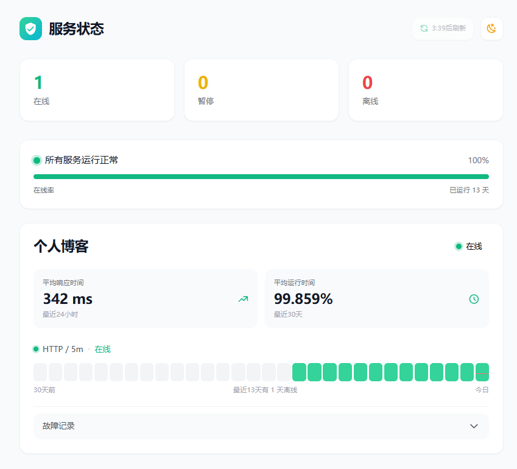

# Uptime Monitor

A beautiful, real-time service status dashboard powered by [UptimeRobot](https://uptimerobot.com/). Built with Nuxt 4 and Tailwind CSS 3.

[中文文档](README_zh.md)

## Features

- **Real-time Monitoring** - Live service status via UptimeRobot API
- **Elegant Dashboard Cards** - Clean, modern card design with uptime history bars
- **Key Metrics** - Average response time and uptime percentage at a glance
- **30-Day Uptime History** - Visual bar chart showing daily availability
- **Incident Logs** - Expandable downtime records with timestamps
- **Auto & Manual Refresh** - Automatic 5-minute polling with a manual refresh button (cooldown timer)
- **Skeleton Loading** - Smooth loading experience while fetching data
- **Dark Mode** - One-click toggle between light and dark themes
- **Fully Responsive** - Optimized for desktop, tablet, and mobile

## Tech Stack

- [Nuxt 4](https://nuxt.com/) - Vue-based full-stack framework
- [Vue 3](https://vuejs.org/) - Progressive JavaScript framework
- [Tailwind CSS 3](https://tailwindcss.com/) - Utility-first CSS framework
- [UptimeRobot API](https://uptimerobot.com/api/) - Monitoring data source
- [Iconify 5](https://iconify.design/) - Icon library

## Screenshot



## Setup

### Prerequisites

- Node.js 18+
- A free [UptimeRobot](https://uptimerobot.com/) account and API key

### Installation

```bash
# Clone the repository
git clone https://github.com/yourusername/uptime-nuxt.git
cd uptime-nuxt

# Install dependencies
pnpm install

# Configure environment variables
cp .env.example .env
# Edit .env and add your UptimeRobot API key
```

### Configuration

Create a `.env` file in the project root:

```env
NUXT_PUBLIC_API_KEY=your_uptimerobot_api_key
```

### Development

```bash
# Start the development server
pnpm run dev
```

The application will be available at `http://localhost:3000`.

### Production

```bash
# Build for production
pnpm run build

# Start the production server
node .output/server/index.mjs
```

Or deploy directly to Vercel, Netlify, or any platform supporting Nuxt 4.

## Project Structure

```
uptime-nuxt/
├── components/          # Vue components
│   ├── MonitorCard.vue  # Status card component
│   ├── StatusBar.vue    # Overall status bar
│   ├── Stats.vue        # Summary statistics
│   ├── AppHeader.vue    # Header with theme & refresh
│   └── ...
├── composables/         # Vue composables
│   ├── useMonitors.ts   # Data fetching logic
│   └── useTheme.ts      # Theme management
├── pages/               # Application pages
│   └── index.vue        # Dashboard page
├── server/              # Server API routes
│   └── api/
│       └── status.post.ts  # UptimeRobot API proxy
└── nuxt.config.ts       # Nuxt configuration
```

## Acknowledgments

UI design inspired by [Uptime-Status](https://github.com/JLinMr/Uptime-Status).

## License

[Apache License](LICENSE)
